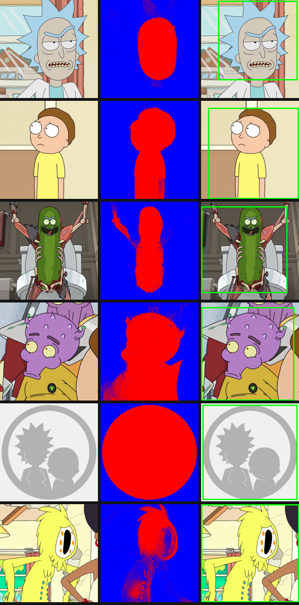
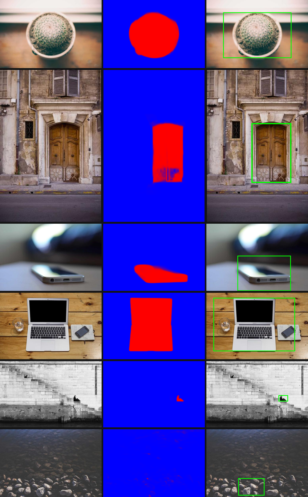

# Milestone 3 — Model Spike: u2netp saliency for smart cropping

**Question:** does a lightweight salient-object-detection model produce good
enough saliency masks on Rick & Morty *cartoon* avatars to drive smart cropping
on-device — and what are the exact input/output/threshold parameters the app's
`SaliencyEngine` must implement?

**Verdict: ✅ GO — u2netp works well on cartoon art.** Proceed to on-device
integration (Milestones 4 Android / 5 iOS). The BlazeFace face-detector fallback
is **not needed**: full-object saliency already localizes characters cleanly,
including non-humanoid ones (Pickle Rick, aliens) that a face detector would miss.



*Left→right per row: original · saliency heatmap (red = salient) · computed 1:1
crop box. Rows: Rick, Morty, Pickle Rick, alien, a full-frame character, and a
hard case (odd creature on a busy background).*

## What was tested

- **Model:** `u2netp` (lightweight U²-Net, 4.3 MB of weights), the variant the
  [implementation plan](../../.agents/plans/) calls for.
- **Inputs:** 10 character avatars pulled from the app's own data source
  (`rickandmortyapi.com/api/character/avatar/{id}.jpeg`, 300×300).
- **Pipeline:** identical to what the app will run —
  `resize 320² → /255 → ImageNet-normalize → TFLite → saliency → CropCalculator`.
  The crop math in [`run_spike.py`](run_spike.py) is a **1:1 port** of
  `shared/.../ml/CropCalculator.kt`, so the boxes shown are exactly what the app
  would produce for a given mask.

## Findings

- **Clean subjects are excellent.** Rick and Morty segment to near-perfect
  silhouettes; the crop recenters on the character (e.g. Rick shifts to
  `x=0.28,w=0.61` for a 3:4 target).
- **Cluttered scenes still work.** Pickle Rick and the alien localize well
  despite busy backgrounds.
- **Ambiguous subjects degrade gracefully.** The one weak case (an odd creature
  blended into the background) produced a diffuse mask with low confidence
  (`0.21`) → the box falls back toward full-frame rather than cropping wrongly.
  This is exactly what the confidence-based fallback in the plan is for.
- **float32 conversion is numerically exact.** Max abs diff vs the source ONNX
  over random inputs: **0.00000**.

## Real photographs (Picsum)

To sanity-check beyond cartoon art, the same pipeline was run over 15 real
photographs sampled across the [Picsum](https://picsum.photos) catalog
(`run_spike.py --avatars <picsum-dir>`), spanning clear subjects, cluttered
scenes, and subjectless textures.



- **Clear subjects are localized well** — a potted cactus, an ornate door (out of
  a whole facade), a laptop, a phone, a grape cluster, and even a small person on
  stone steps were each isolated correctly.
- **Focus / contrast cues work** — a phone shot with shallow depth of field was
  picked out cleanly against the blurred background.
- **Subjectless scenes degrade gracefully** — a river-pebble texture produced a
  near-empty mask and confidence `0.03` (the "no salient object → `CENTER`" path).
- **Over-zoom on tiny subjects** — the small, distant person (0.3 % salient) was
  found but produced a very tight crop. Real photos need a **minimum-crop-size
  guard** (e.g. don't crop below ~30–40 % of the frame) that the square cartoon
  avatars never exercised.

**Implications for the app:** the confidence-based fallback is *not optional* for
real content, and the crop math should clamp to a minimum size to avoid
over-zooming on small subjects. Also note `run_spike.py` resizes to a 320² square
(matching the avatar pipeline), so non-square photos are fed slightly
aspect-distorted; a production path should letterbox/pad to preserve aspect.

## Locked-in parameters for `SaliencyEngine`

| Parameter | Value |
|---|---|
| Input tensor | `[1, 320, 320, 3]` NHWC, float32 |
| Preprocess | RGB → resize 320² (bilinear) → `/255` → normalize `mean=[0.485,0.456,0.406]`, `std=[0.229,0.224,0.225]` |
| Output tensor | index **0** of 7, shape `[1, 320, 320, 1]`, **sigmoid already applied** (∈ [0,1]) |
| Post-process | min–max normalize the mask before thresholding |
| Threshold | `0.5` (feeds `CropCalculator.threshold`) |
| Fallback | low `confidence` → prefer `CropRegion.CENTER` (wire the cutoff in Milestone 6) |

## Model artifact

- [`models/u2netp_320_float32.tflite`](models/) — the validated model (4.57 MB),
  ready to drop into `androidApp` assets / iOS bundle for Milestone 4/5.
- A float16 variant (2.32 MB) converts fine but needs the GPU/fp16 delegate to
  allocate (the plain CPU reference kernel rejects fp16 conv input). Revisit as a
  size optimization once the Android GPU delegate is wired.

## Provenance & reproducing the conversion

The weights come from the HuggingFace repo
[`BritishWerewolf/U-2-Netp`](https://huggingface.co/BritishWerewolf/U-2-Netp)
(`onnx/model.onnx`, fp32, 4.57 MB) — a clean, published u2netp export. No
verifiable single-file `u2netp.tflite` exists in the wild (PINTO_model_zoo ships
a 10 GB all-formats bundle; the community publishes u2netp only as `.pth`/`.onnx`),
so we convert:

```bash
# see convert.sh for the full recipe
onnxslim model.onnx u2netp_slim.onnx        # fold dynamic Resize sizes to static
onnx2tf  -i u2netp_slim.onnx -o tf          # NCHW→NHWC, emits float32/float16 tflite
```

`onnxslim` is essential: U²-Net's decoder uses dynamic *upsample-to-target-size*
Resize ops that onnx2tf mis-resolves unless the shapes are pre-folded (they are
static once the input is fixed at 320²).

See [`requirements.txt`](requirements.txt) for the exact Python toolchain
(Python 3.12 — TensorFlow/LiteRT have no 3.14 wheels yet).
